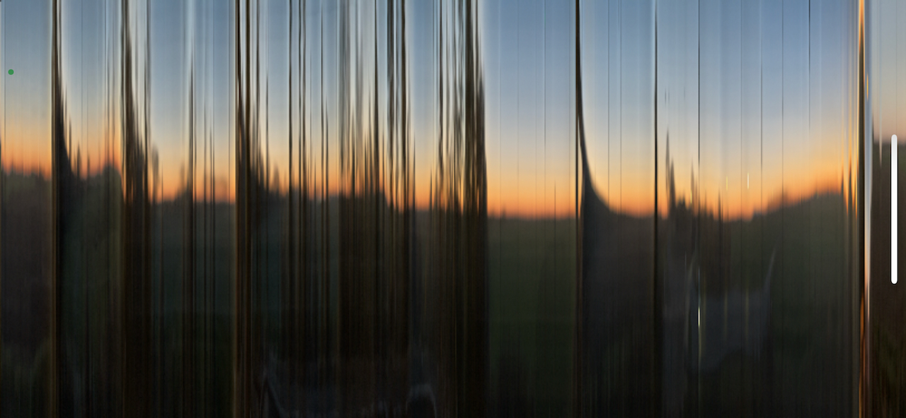

# About scaniO

### description and usage
scaniO is an experimental camera that views the world of time and space in different ways. 
scaniO uses variations on the slit-scan technique that gives images where time is spread out - where parts of the image are older or younger than others. 
scan the world in 'push' style where only the thing that move appear in the cameras or explore 'wipe' style where those things that move get distorted and their motion through the world leaves trails and traces.  Both styles work in horizontally or vertically. Double tap the screen to explore the different styles.

scaniO has no option to record your images - deliberately so - it is a lens or periscope into seeing time in a different way - though if you want to save what you have seen to ee it again another time just use your camera's options to snap a screenshot or record the screen to video.

• Double tap the screen to loop through the 4 different styles of seeing the world, 

• Drag left and right across the screen to speed up and slow down the capturing of time.

### https://buzzo.com  

https://youtube.com/danbuzzo

© 2022 daniel buzzo

